title:Outline
content_class:flexbox vleft

- Motivation
- Megastore
	* Features
	* Scalability
	* Availability
	* Putting them all together
- Observation
- Conclusions

---

title:Motivation
content_class:flexbox vleft

- Conflicting requirements
	*  RDBMS - *easy* to use but does not scales
	* NoSQL - *scales*, but not easy to use
	
- Interactive online service require highly *available* and fast response time 

---

title:Megastore
content_class:flexbox vleft

- *Easy* to use: familiar ACID semantics
- Scalable: data partioning
- Available: modified Paxos

---

title:Scalable Replication

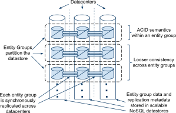

---

title:Entity Groups
subtitle:Examples

- Email: User account
- Blogs: 
	* User profiles
	* Posts and metadata
	* Each blog
	* New blogs by two-phase commit
- Maps:
	* Non overlapping patches
	* Two-phase commit for cross patch operations
 
---

title:Entity Groups

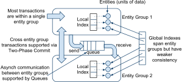

---

title:Entity Groups
subtitle: Physical Layout
content_class:flexbox vleft

- Google's Bigtable
- Allow applications to control placement of data
- Entity group as continuous ranges of Bigtable rows

---

title:API Design Philosphy
content_class:flexbox vleft

- Cost transparency
	* Joins in application code
	* Outer joins with parallel queries

---

title:Data Model
build_lists:true
content_class:flexbox vleft

* Strongly typed schema like RDBMS
* Key-Columnized layout of NoSQL.

---

title:Data Model
subtitle:Photo storage example
content_class:posrelative
build_lists:true

* Pre joining with Keys 
* Local and global Indexes
* STORING clause <!-- additional information along with index e.g. thumbnails -->
* Inline indexes <!-- slicing information from child entities to parent for
  faster access. For example, PhotosByTime index can be saved in User table as
  normal index or a repeated property on User, with time-ordered entry for each
  conatained Photo -->
 

 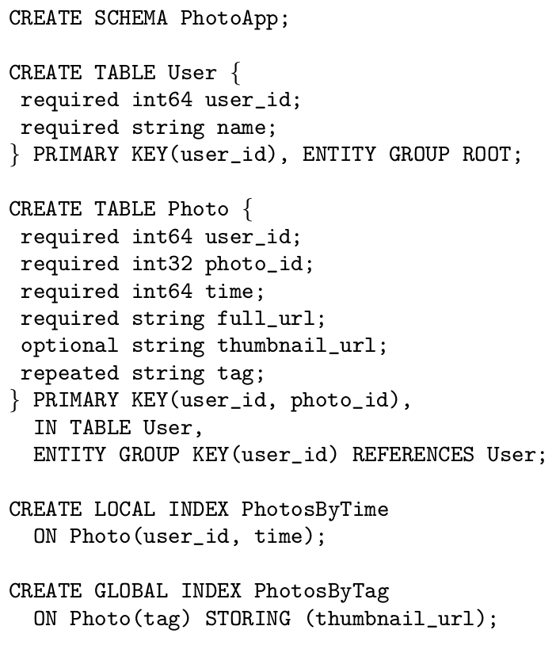

 
---

title:Data Model
subtitle: Mapping to Bigtable
build_lists:true

- Bigtable Column name: Table name.Megastore column name
- Bigtable row for root entity includes entity group metadata
- Megatable Index becomes Bigtable row key

---

title:Transactions and concurrency Control
content_class:flexbox vleft
build_lists:true

- Multi-version concurrency control : Parallel reads and writes
- Supports current, snapshot and inconsistent reads
- Transaction lifecyle:
	* Read the metadata of last committed transaction
	* Gather writes into log
	* Commit using Paxos
	* Write mutations 
	* Clean up
- Cross entity group operations
	- Queues
	- Two phase commits

---

title:Other features
content_class:flexbox vleft
build_lists:true

- Full text index
- Snapshot and incremental backup
- Encryption 

---

title: Modified Paxos - Fast Reads

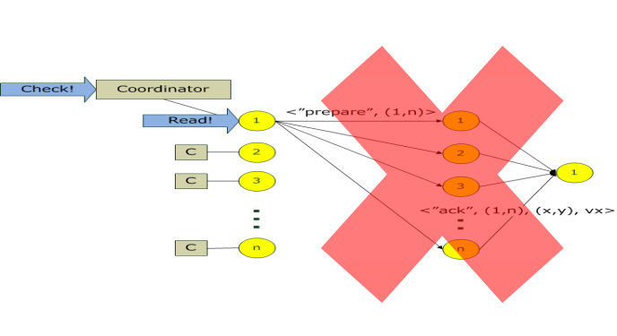

<footer class="source" > Source: Arinto Murdopo's slides </source>

---

title: Original Paxos Writes

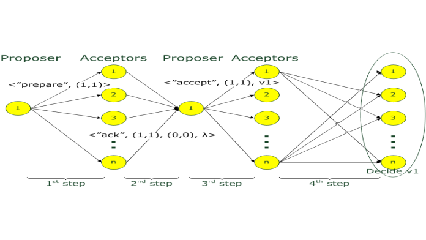

<footer class="source" > Source: Arinto Murdopo's slides </source>

---

title: Modified Paxos - Fast Writes

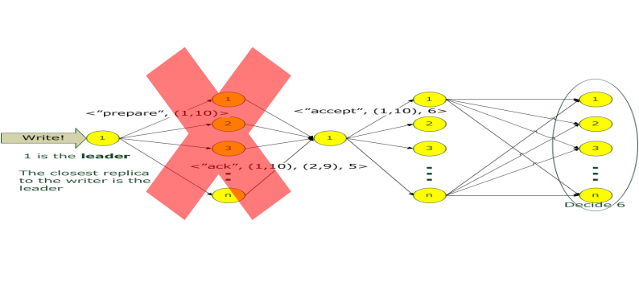

<footer class="source" > Source: Arinto Murdopo's slides </source>

---

title: Architecture

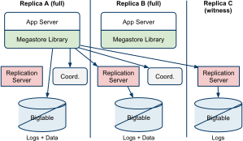

---

title:Algorithms 

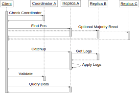

---

title:Algorithms

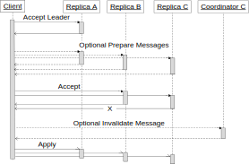

---
title:Coordinator Availability

- Failure detection
	- Coordinate must maintain majority of locks with Chubby
	- Write outage unless lock expires
	- Asymetric network partition requires manual intervention
- Validation races
	- Validate/Invalidate message accompanied by log position
- Advantages
	- Simpler hence more available and cheap
	- Homogenous workload hence predictable
	- Light network requirement
	- Can be centrally disabled/enabled
	- Quorum of Chubby locks detects most network partitions and node
	unavailability

---

title: Production metrics
subtitle: Availability

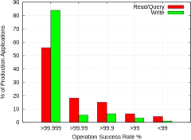

---

title: Production metrics
subtitle: Availability

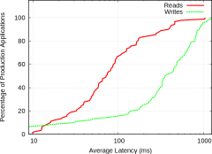

---

title:Conclusion

- Megastore uses Paxos for synchronous wide area replication
- Latency penalty is offset by ease of use and availability
- Provides ACID transactions, indexes, queues using Bigtable
- Entity grouping allows scalability and throughput

